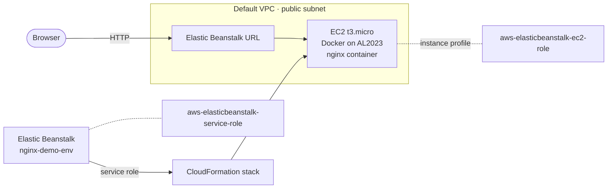

# AWS Elastic Beanstalk — Docker / nginx Deployment

> **Context:** Training sandbox

Hands-on lab: a containerized nginx site deployed to a single-instance AWS Elastic Beanstalk environment, validated end to end, then decommissioned.

The lab compares managed (PaaS) deployment with infrastructure-based hosting. It covers IAM role separation, environment and scaling configuration, the platform's artifact requirements, health reporting, and deployment-failure behavior.

| | |
|---|---|
| **Platform** | AWS Elastic Beanstalk — Docker on 64bit Amazon Linux 2023 (4.12.1) |
| **Region** | `us-east-1` |
| **Topology** | Single On-Demand `t3.micro` instance, public subnet, nginx proxy |
| **Outcome** | Custom landing page served on the Elastic Beanstalk URL; environment health **Ok** |
| **Status** | Lab — decommissioned after validation |

**Contents:**
[Architecture](#architecture) ·
[Design decisions](#design-decisions) ·
[Implementation](#implementation) ·
[Acceptance validation](#acceptance-validation) ·
[Decommissioning](#decommissioning) ·
[Limitations](#known-limitations)

---

## Architecture



---

## Design decisions

| Decision | Lab choice | Rationale | Production would differ |
|---|---|---|---|
| Deployment artifact | Docker bundle (`Dockerfile` + `index.html`) | A Docker-platform environment requires a `Dockerfile` or `Dockerrun.aws.json`. A static HTML bundle failed to deploy ([observed](#step-2--create-the-environment-and-deploy-the-docker-artifact)). | Bundle built by a CI pipeline from source control |
| Environment type | Single instance, On-Demand `t3.micro` | Lab scope and minimal spend | Load-balanced, multi-instance across subnets for redundancy |
| Deployment policy | All at once | Single instance; no capacity to roll across | Rolling or immutable deployments to avoid downtime |
| IAM model | Separate service role and EC2 instance profile | The two serve different functions: one is used by Elastic Beanstalk, the other by the instance | Same separation, with permissions reviewed against least privilege |
| Instance metadata | IMDSv1 disabled | Requires IMDSv2 for metadata access | Same |
| Host access | No EC2 key pair | No SSH path into the instance | Session Manager–style access instead of SSH keys, if host access is needed |
| Exposure | Public IP, default VPC security group, HTTP | Lab exposure on the generated URL | HTTPS with a certificate on a load balancer, custom domain, instances in private subnets |
| Observability | Enhanced health; log streaming and X-Ray disabled | Enhanced health gives useful visibility even in a simple environment | Log streaming to CloudWatch with retention, plus alarms |
| Platform updates | Managed updates on — minor and patch | Keeps the platform patched without manual work | Same, scheduled in a maintenance window |

---

## Build values

Key settings. Full configuration is collapsed below.

| Setting | Value |
|---|---|
| Application / environment | `nginx-demo-app` / `nginx-demo-env` |
| Tier | Web Server Environment |
| Platform | Docker running on 64bit Amazon Linux 2023, 4.12.1 |
| Service role | `aws-elasticbeanstalk-service-role` |
| EC2 instance profile | `aws-elasticbeanstalk-ec2-role` |
| Environment type | Single instance, On-Demand, `t3.micro` |
| Proxy server | nginx |
| Health reporting | Enhanced |
| Deployment policy | All at once |

<details>
<summary>Full environment configuration</summary>

| Area | Setting | Value |
|---|---|---|
| Project | Region | `us-east-1` |
| | Domain | Auto-generated Elastic Beanstalk URL |
| Access | EC2 key pair | Not configured |
| Networking | VPC | Default lab VPC |
| | Instance subnet | Single public subnet |
| | Public IP address | Enabled |
| | Database | Not enabled |
| | Tags | None |
| Instance | Processor | x86_64 |
| | Instance types | `t3.micro` (`t3.small` also listed during configuration) |
| | AMI | Auto-selected by Elastic Beanstalk |
| | Root volume | gp3, 10 GB |
| | IMDSv1 | Disabled |
| | Security group | Default VPC security group |
| Monitoring | Monitoring interval | 5 minutes |
| | CloudWatch custom metrics | Not configured |
| | Log streaming | Disabled |
| | X-Ray | Disabled |
| Updates | Managed platform updates | Enabled — minor and patch |
| | Instance replacement | Disabled |

</details>

---

## Prerequisites

- Default VPC with a public subnet in `us-east-1`
- A local shell with `zip`

---

## Implementation

### Step 1 — Build the Docker deployment artifact

> [!WARNING]
> The bundle must match the environment platform. A Docker-platform environment needs a `Dockerfile` or `Dockerrun.aws.json` at the root of the bundle. A static HTML file alone will not deploy.

**Action:**

```bash
mkdir ~/beanstalk-docker-v1
cat > index.html <<EOF ... EOF    # custom landing page
cat > Dockerfile <<EOF ... EOF    # nginx container
zip -r ../beanstalk-docker-v1.zip .
```

**Validate:**

```bash
ls -lh ~/beanstalk-docker-v1.zip
```

 Pass when the ZIP is listed.

### Step 2 — Create the environment and deploy the Docker artifact

**Action:** Create application `nginx-demo-app` and environment `nginx-demo-env` with the [build values](#build-values), and deploy `beanstalk-docker-v1.zip`.

**Validate — environment creation:**

- [x] IAM service role `aws-elasticbeanstalk-service-role` created
- [x] IAM EC2 instance profile `aws-elasticbeanstalk-ec2-role` created
- [x] Environment events show EC2 instance creation
- [x] Deployment history shows successful environment creation
- [x] Public Elastic Beanstalk domain generated

**Validate — deployment and health:**

- [x] Docker platform on Amazon Linux 2023 deployed
- [x] Environment health: **Ok**
- [x] Health dashboard, instance health: **Ok**

> [!IMPORTANT]
> Health **Ok** does not prove the new version is running. Elastic Beanstalk rolls a failed deployment back to the last known good version, and the environment stays healthy. Confirm the deployed content in [acceptance validation](#acceptance-validation).

**If it fails:**

| Symptom | Cause | Fix | Observed |
|---|---|---|---|
| Deployment fails while environment health stays **Ok** | Bundle doesn't match the Docker platform: a static HTML file with no `Dockerfile` or `Dockerrun.aws.json`. Elastic Beanstalk rolled back to the last known good version. | Rebuild the bundle per [Step 1](#step-1--build-the-docker-deployment-artifact) and redeploy |  Yes |
| Environment creation or deployment fails, cause unclear | — | Read the environment events and the CloudFormation stack status messages | |

---

## Acceptance validation

| # | Test | Method | Expected | Result |
|---|---|---|---|---|
| 1 | Service publicly reachable | Browse to the Elastic Beanstalk domain | Page loads |  Pass |
| 2 | Deployed version is the Docker artifact | Inspect the loaded page | Custom Docker-based landing page displayed |  Pass |

---

## Rollback and recovery

Elastic Beanstalk automatically rolls a failed deployment back to the last known good version. This was observed during the build (see [Step 2](#step-2--create-the-environment-and-deploy-the-docker-artifact)). No manual rollback was performed.

---

## Decommissioning

> [!CAUTION]
> Terminating the environment deletes its compute resources and releases the public URL. This cannot be undone.

1. Terminate environment `nginx-demo-env`.

   **Validate:** CloudFormation stack enters `DELETE_IN_PROGRESS`.

2. Confirm the results of termination:
   - [x] Public environment URL released
   - [x] Associated compute resources removed

 Complete when no environment resources remain that incur AWS spend.

---

## Known limitations

These apply to the lab build as deployed. See [design decisions](#design-decisions) for how production would differ.

| Limitation | Impact |
|---|---|
| Single instance | No instance redundancy |
| No EC2 key pair | No SSH access to the instance |
| Log streaming disabled | Instance logs are not retained in CloudWatch |
| HTTP only on the generated domain | No TLS, no custom domain |

### Deferred work

| Item | Risk until done |
|---|---|
| Enable CloudWatch log streaming | Logs are lost when the instance or environment is terminated |
| Configure HTTPS / SSL and custom domain mapping | Traffic is unencrypted, and the endpoint is a generated URL |
