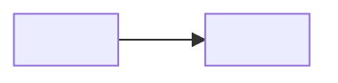

# <Service> — <What was built>

<!--
How to use this template
- Copy into the domain folder for the system the work acts on (see README "Where things go").
- Replace every <PLACEHOLDER>. Delete any section or field that doesn't apply; don't write "N/A".
- Commands and their checks go inside the step where they run. There is no global Commands or Validation section.
- Code longer than a few lines goes in a companion file next to this document; link to it.
- Expected output goes in a separate ```text block, never in the command block.
- One sentence per line in prose, so diffs stay readable.
- No secrets, tenant or account IDs, public IPs, or client names. Redact screenshots before committing.
-->

> **Context:** <Training sandbox | Personal lab | Production-derived (recreated, sanitized)>

<One sentence: what was built and the outcome.>

<One or two sentences: why it was built and what it exercises.>

| | |
|---|---|
| **Platform** | <Service and version> |
| **Topology** | <Short description of what runs where> |
| **Outcome** | <Observable end state> |
| **Status** | <Active / Decommissioned / Superseded by `<repo or entry>`> |

---

## Architecture

<!-- Optional. Keep it small; delete if a sentence explains it. -->



---

## Design decisions

| Decision | Choice | Rationale | Production would differ |
|---|---|---|---|
| <Decision> | <What was chosen> | <Why> | <What changes for production, or "Same"> |

---

## Build values

| Setting | Value |
|---|---|
| <Setting> | `<value>` |

<details>
<summary>Full configuration</summary>

| Area | Setting | Value |
|---|---|---|
| <Area> | <Setting> | <Value> |

</details>

---

## Prerequisites

- <Dependency, access, or tool, with minimum version>

---

## Implementation

### Step 1 — <Imperative action>

> [!WARNING]
> <What breaks or is hard to reverse if this is done wrong. Delete if none.>

**Action:**

```bash
<exact command>
```

**Expected result:**

```text
<what the command prints or the state that results>
```

**Validate:**

```bash
<independent check>
```

✅ Pass when <specific, observable criterion>.

**If it fails:**

| Symptom | Cause | Fix | Observed |
|---|---|---|---|
| <Symptom> | <Cause> | <Fix> | <✅ Yes, if it actually happened> |

### Step 2 — <Imperative action>

**Action:** <Console path or command>

**Validate:**

- [ ] <Check>

> [!IMPORTANT]
> <Checkpoint or point of no return. Delete if none.>

---

## Acceptance validation

End-to-end checks from the consumer's side, after all steps are complete.

| # | Test | Method | Expected | Result |
|---|---|---|---|---|
| 1 | <Test> | <Method> | <Expected> | <✅ Pass / ❌ Fail> |

---

## Rollback and recovery

<How to back out or restore. State plainly if no rollback was performed.>

---

## Operations

<!-- Only for services that persist. Delete for decommissioned labs. -->

| | |
|---|---|
| **How to locate resources** | <Name or tag pattern — not IDs> |
| **Health check** | <Command or dashboard, and a healthy value> |
| **Logs** | <Where and how to query> |
| **Alerts** | <What fires and who receives it> |

---

## Decommissioning

> [!CAUTION]
> <What is lost and cannot be undone.>

1. <Action>

   **Validate:** <Check>

✅ Complete when <no billable or orphaned resources remain>.

---

## Known limitations

| Limitation | Impact |
|---|---|
| <Limitation> | <Impact> |

### Deferred work

<!-- Only gaps that carry risk or block production use. No learning wishlists. -->

| Item | Risk until done |
|---|---|
| <Item> | <Risk> |
