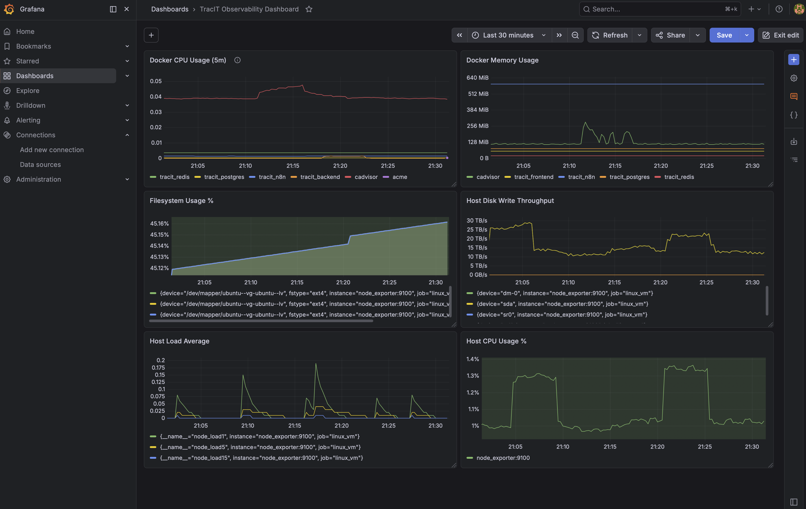
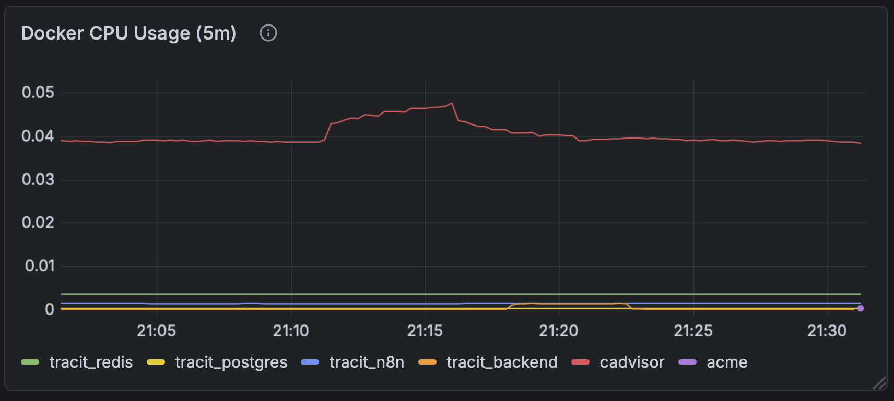
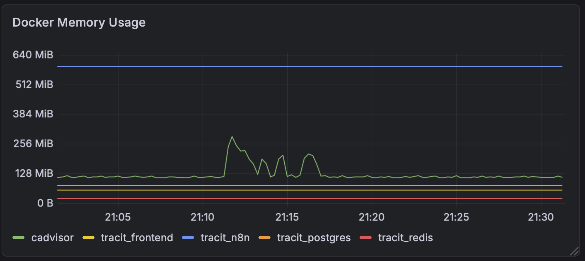
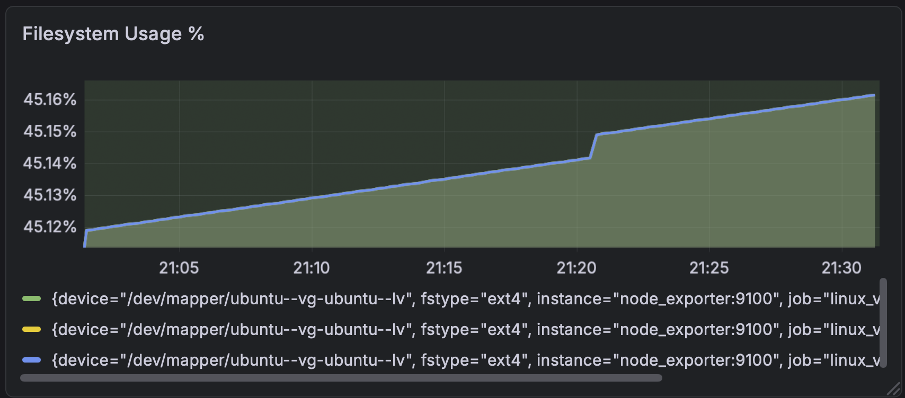
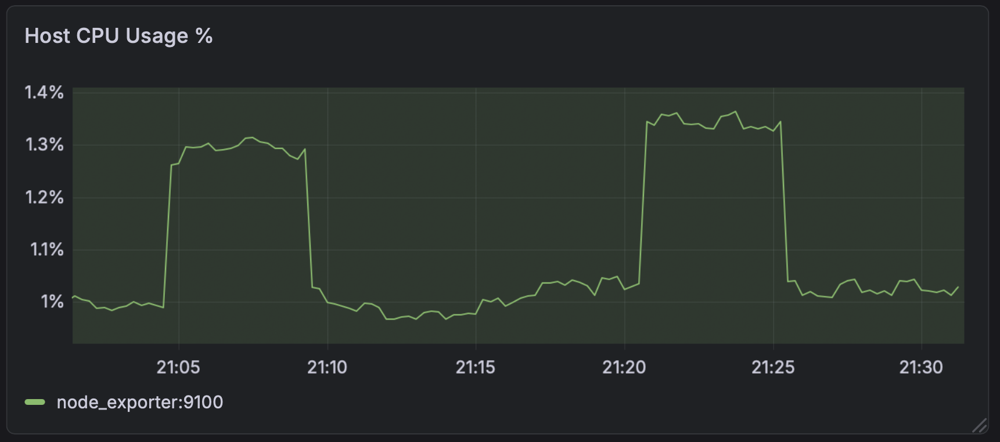
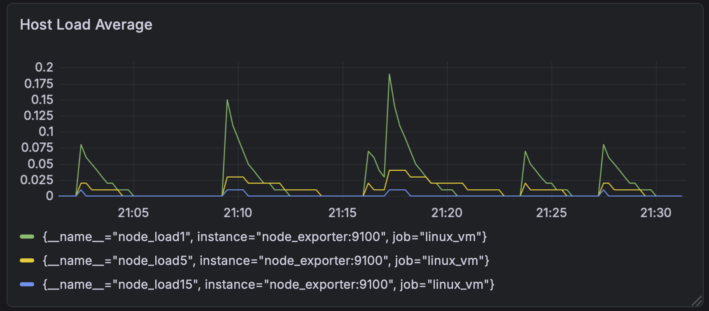
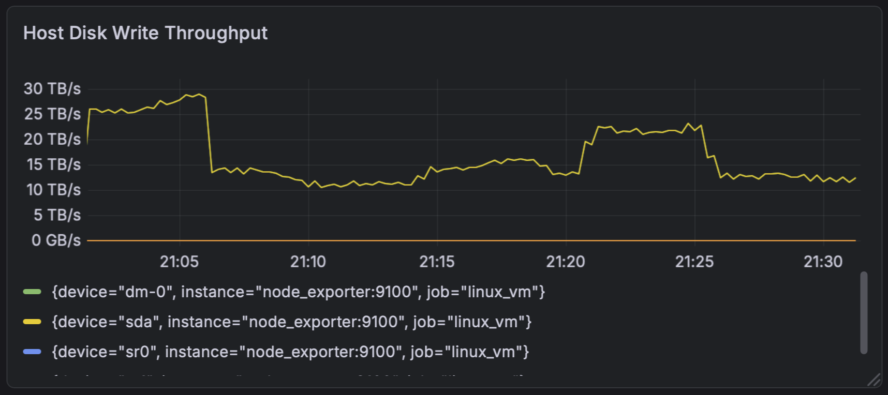

# 🐳 Docker Observability Stack

> **Context:** Personal lab

Internal observability deployment focused on monitoring Linux infrastructure and Docker workloads using Prometheus, Grafana, cAdvisor, and Node Exporter. This build focused on operational visibility, telemetry validation, container monitoring, dashboard engineering, and proactive infrastructure monitoring before service-impacting events occur.

The environment was deployed across multiple internal hosts with Docker telemetry collection, PromQL dashboard creation, YAML relabeling, internal-only monitoring access, subnet troubleshooting, firewall validation, and operational dashboard development aligned to real-world infrastructure monitoring practices.





# 🎯 Objective

Design and deploy an internal observability stack capable of:

- Monitoring Linux host infrastructure  
- Monitoring Docker container telemetry  
- Collecting Prometheus metrics  
- Building Grafana operational dashboards  
- Normalizing container naming visibility  
- Validating telemetry collection flow  
- Troubleshooting PromQL and YAML configurations  
- Monitoring infrastructure resource utilization before operational impact  


# 🏗️ Environment Build Choices

## Core Technologies Used

- Ubuntu Linux VM  
- Docker  
- Docker Compose  
- Prometheus  
- Grafana  
- cAdvisor  
- Node Exporter  
- Synology NAS  
- Internal LAN Networking  
- Internal DNS Validation  


## Architecture Approach

- Dedicated Linux monitoring VM  
- Docker-based observability deployment  
- Internal-only telemetry exposure  
- Separate telemetry source host  
- Prometheus centralized metric scraping  
- cAdvisor container telemetry collection  
- Node Exporter Linux host monitoring  
- Grafana dashboard visualization  
- YAML relabeling for container normalization  
- NOC-style operational dashboard visibility  


# ⚙️ Design Decisions

- Docker-based deployment for modular observability services  
- Internal-only monitoring exposure without WAN publishing  
- Separate telemetry source hosted on Synology Docker environment  
- Prometheus used for centralized metric scraping  
- Grafana used for operational dashboard visualization  
- cAdvisor used for Docker container telemetry collection  
- Node Exporter used for Linux host resource monitoring  
- YAML relabeling used for readable container naming normalization  
- PromQL queries manually validated during dashboard construction  
- Single monitoring host architecture used for simplified deployment flow  
- Dashboard visibility prioritized before alerting integration  
- Internal subnet segmentation maintained between monitoring services and WAN access  
- Firewall validation performed during telemetry troubleshooting and port accessibility testing  


# 🔁 ACTUAL BUILD FLOW (Correct Deployment Order)


# 🏗️ Linux Monitoring VM Build


## 1️⃣ Deploy Ubuntu Monitoring Host

Deploy Ubuntu Linux VM for centralized observability services.

Validation included:

- SSH connectivity confirmed  
- Internal DNS validated  
- Package repositories reachable  
- LAN network communication validated  


## 2️⃣ Perform Linux Updates & Patching

Run:

```bash
sudo apt update -y
sudo apt upgrade -y
```

Purpose:

- Patch Linux operating system  
- Validate package repository access  
- Confirm baseline system readiness  


## 3️⃣ Install Docker & Docker Compose

Run:

```bash
sudo apt install docker.io -y
sudo apt install docker-compose -y
```

Validation:

```bash
docker --version
docker-compose --version
```

Purpose:

- Install container runtime  
- Prepare Docker observability deployment environment  


## 4️⃣ Enable Docker Services

Run:

```bash
sudo systemctl enable docker
sudo systemctl start docker
```

Validation:

```bash
sudo systemctl status docker
```

Purpose:

- Confirm Docker daemon operation  
- Validate service persistence after reboot  


# 🌐 Network & Access Validation


## 1️⃣ Validate Internal Connectivity

Validation included:

- SSH communication between hosts  
- Internal IP reachability  
- DNS validation  
- LAN communication testing  


## 2️⃣ Troubleshoot Internal Subnet Segmentation

Observed:

- Docker telemetry source located on separate internal subnet  

Impact:

- Prometheus unable to scrape telemetry targets initially  

## 3️⃣ Validate Firewall Rules & Port Accessibility

Ports validated:

- `3000` → Grafana  
- `9090` → Prometheus  
- `8080` → cAdvisor  
- `9100` → Node Exporter  

Validation tools:

```bash
curl
ping
ss -tulnp
```

Purpose:

- Confirm telemetry accessibility  
- Validate exporter communication  
- Confirm internal-only monitoring exposure  


## 4️⃣ Validate Reverse Proxy & Internal Access Awareness

Validation included:

- Internal-only monitoring exposure  
- Restricted WAN accessibility  
- Internal DNS resolution awareness  
- Reverse proxy path validation considerations  


# 🐳 Docker Observability Deployment


## 1️⃣ Build Docker Compose Stack

Services deployed:

- Prometheus  
- Grafana  
- cAdvisor  
- Node Exporter  

Purpose:

- Centralized telemetry collection  
- Infrastructure resource visibility  
- Docker container monitoring  
- Dashboard visualization  


## 2️⃣ Deploy Docker Containers

Run:

```bash
docker-compose up -d
```

Validation:

```bash
docker ps
```

Purpose:

- Launch observability services  
- Validate container deployment status  


## 3️⃣ Validate Running Services

URLs validated:

- `http://<monitoring-host>:3000` → Grafana  
- `http://<monitoring-host>:9090` → Prometheus  
- `http://<synology-ip>:8080` → cAdvisor  
- `http://<monitoring-host>:9100/metrics` → Node Exporter  

Purpose:

- Confirm web service accessibility  
- Confirm telemetry endpoints operational  
- Validate exporter metric exposure  

# 📊 Prometheus Configuration & Telemetry Validation


## 1️⃣ Configure Prometheus Scrape Targets

Prometheus configured to scrape:

- Linux monitoring VM  
- Synology cAdvisor telemetry source  
- Node Exporter metrics  

Purpose:

- Centralize metric collection  
- Normalize infrastructure visibility  
- Validate multi-host telemetry collection  


## 2️⃣ Validate Prometheus Metric Collection

Validation performed:

```bash
curl http://<target-ip>:9100/metrics
curl http://<target-ip>:8080/metrics
```

Prometheus query validation:

```promql
container_cpu_usage_seconds_total
```

Purpose:

- Confirm exporter metric visibility  
- Validate Prometheus scrape behavior  
- Confirm telemetry ingestion  


## 3️⃣ Troubleshoot Telemetry Collection Issues

Issues observed:

- Prometheus unable to scrape telemetry targets initially  
- Container naming unreadable inside Grafana dashboards  
- Port accessibility failures between internal hosts  
- YAML relabeling syntax troubleshooting required  

Fixes applied:

- Firewall rule validation  
- Internal subnet troubleshooting  
- YAML relabeling normalization  
- Prometheus scrape validation  
- Docker service restart testing  

# ⚙️ YAML Relabeling & Container Normalization


## 1️⃣ Configure YAML Relabeling Rules

Purpose:

- Normalize Docker container names  
- Improve Grafana dashboard readability  
- Replace long container IDs with operational naming  

Example operational containers:

- `tracit_frontend`  
- `tracit_backend`  
- `tracit_postgres`  
- `tracit_redis`  
- `cadvisor`

Example relabeling rule:

See [`prometheus.example.yml`](prometheus.example.yml)

Purpose: Replace raw Docker container IDs with operational container names for improved Grafana readability and telemetry visibility.

## 2️⃣ Restart Prometheus After YAML Changes

Run:

```bash
docker-compose restart prometheus
```

Validation:

```bash
docker-compose ps
```

Purpose:

- Reload Prometheus configuration  
- Validate YAML parsing success  
- Confirm updated relabeling visibility  


# 📈 Grafana Dashboard Engineering


## 1️⃣ Configure Grafana Access

Initial setup included:

- Grafana account creation  
- Dashboard initialization  
- Prometheus datasource configuration  

Purpose:

- Enable operational dashboard visibility  
- Connect Prometheus telemetry into Grafana  


## 2️⃣ Build Operational Dashboards

Dashboards created for:

- CPU utilization  
- Memory utilization  
- Filesystem usage  
- Network throughput  
- Docker container monitoring  
- Container resource utilization  
- Per-core CPU monitoring  
- Service visibility  

# 3️⃣ Validate PromQL Queries

## 📊 Docker CPU Usage (5m)



```promql
topk(5,
  sum by (short_id) (
    label_replace(
      rate(container_cpu_usage_seconds_total{
        job="synology_cadvisor",
        id=~"/docker/.+"
      }[5m]),
      "short_id",
      "$1",
      "id",
      ".*/docker/([a-f0-9]{12}).*"
    )
  )
)
```

Purpose: Displays top Docker containers by CPU utilization over a rolling 5-minute window.


## 📊 Docker Memory Usage



```promql
topk(5,
  sum by (container_name) (
    container_memory_usage_bytes{
      job="synology_cadvisor",
      container_name!=""
    }
  )
)
```

Purpose: Displays top containers by active memory consumption.


## 📊 Filesystem Usage %



```promql
100 - (
  (
    node_filesystem_avail_bytes{
      job="linux_vm",
      fstype!="tmpfs",
      mountpoint!="/run"
    }
    /
    node_filesystem_size_bytes{
      job="linux_vm",
      fstype!="tmpfs",
      mountpoint!="/run"
    }
  ) * 100
)
```

Purpose: Calculates active filesystem utilization percentage for operational disk monitoring.


## 📊 Host CPU Usage %



```promql
100 - (
  avg by(instance) (
    rate(node_cpu_seconds_total{
      job="linux_vm",
      mode="idle"
    }[5m])
  ) * 100
)
```

Purpose: Calculates active host CPU utilization percentage across monitored Linux systems.


## 📊 Host Load Average



```promql
node_load1{job="linux_vm"}

node_load5{job="linux_vm"}

node_load15{job="linux_vm"}
```

Purpose: Displays Linux host load averages across 1, 5, and 15 minute intervals.


## 📊 Host Disk Write Throughput



```promql
rate(node_disk_written_bytes_total{
  job="linux_vm"
}[5m])
```

Purpose: Displays active disk write throughput across monitored Linux systems.

## 4️⃣ Validate Dashboard Population

Confirmed visibility for:

- Linux host metrics  
- Synology telemetry  
- Docker container metrics  
- Resource utilization trends  
- Container normalization labels  
- Infrastructure monitoring panels  


# 🧪 Validation


## Confirmed

- Ubuntu monitoring VM deployed successfully  
- Docker services operational  
- Prometheus telemetry collection functional  
- Node Exporter metrics visible  
- cAdvisor telemetry visible  
- Grafana dashboards populated successfully  
- YAML relabeling normalized container visibility  
- Internal firewall rules validated  
- Internal subnet communication restored  
- PromQL queries operational  
- Dashboard telemetry updated successfully  
- Internal-only monitoring exposure maintained  


# 🧯 Lessons Learned


## Issues Encountered

- Internal subnet segmentation blocked telemetry initially  
- Docker container IDs difficult to read operationally  
- Firewall rules prevented telemetry communication  
- YAML syntax troubleshooting required multiple iterations  
- PromQL syntax validation required dashboard testing  
- Telemetry flow troubleshooting required multi-host validation  

## Fixes Applied

- Validated internal subnet communication  
- Opened required monitoring ports  
- Rebuilt Prometheus YAML relabeling configuration  
- Restarted Prometheus after configuration changes  
- Validated exporter accessibility with curl testing  
- Confirmed telemetry ingestion through Prometheus queries  


## Key Takeaways

- Observability deployments require strong telemetry validation  
- YAML relabeling significantly improves operational readability  
- Internal firewall rules commonly impact telemetry visibility  
- PromQL troubleshooting is critical for dashboard engineering  
- Dashboard visibility should be validated before alerting implementation  
- cAdvisor provides valuable container telemetry visibility  
- Operational dashboards improve proactive infrastructure monitoring  


# 🚀 Future Improvements

- Alertmanager integration  
- Grafana alerting policies  
- Multi-host Prometheus federation  
- High Availability Prometheus deployment  
- Distributed telemetry collection  
- WAN-restricted reverse proxy integration  
- Multi-region observability architecture  
- Kubernetes telemetry integration  
- Datadog comparison deployment  
- Loki centralized logging integration  
- Grafana role-based access control  
- Long-term telemetry retention architecture  


# 🧹 Final Hygiene Cleanup


## Cleanup Performed

None during initial deployment.


## Recommended Cleanup

- Remove unused Docker containers  
- Remove unused Docker images  
- Validate firewall rules after deployment  
- Archive old Prometheus metrics if lab reset required  
- Backup Grafana dashboards before rebuilds  
- Validate YAML configurations before future updates  
